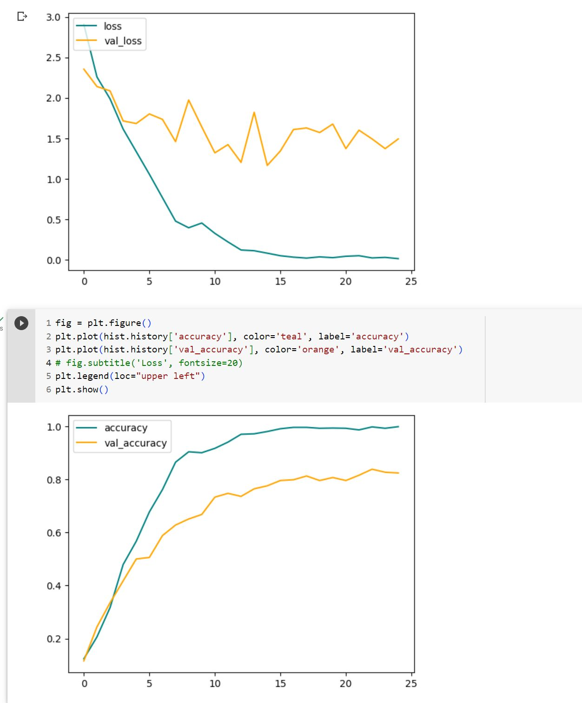
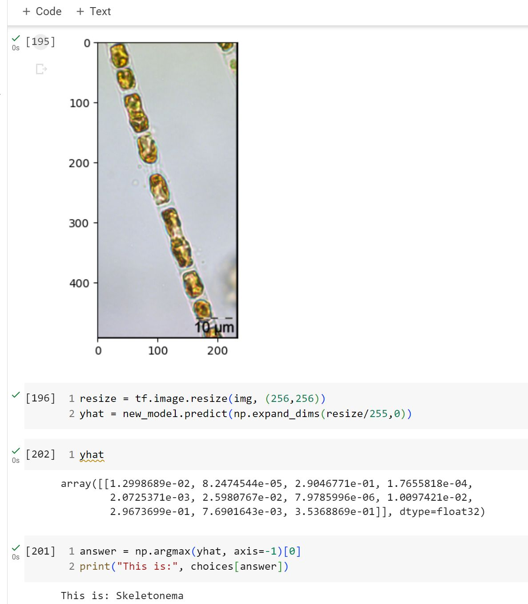
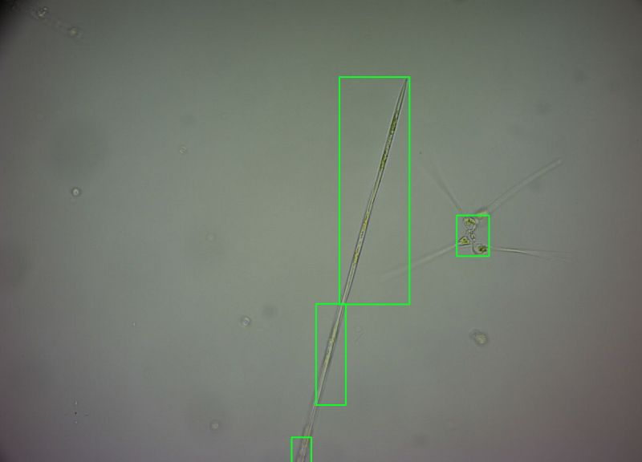
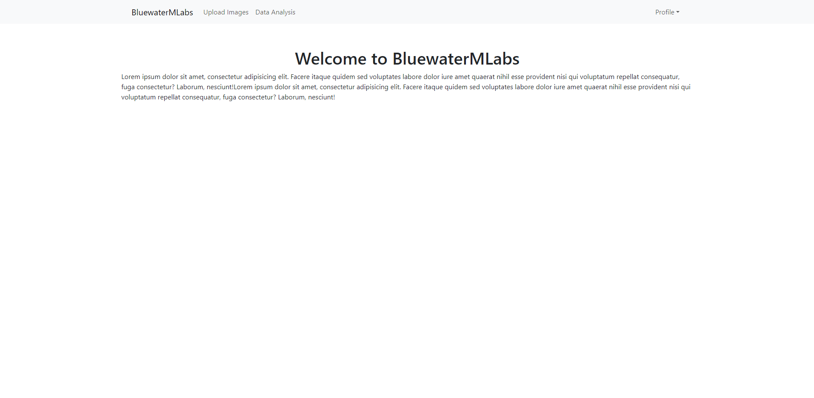
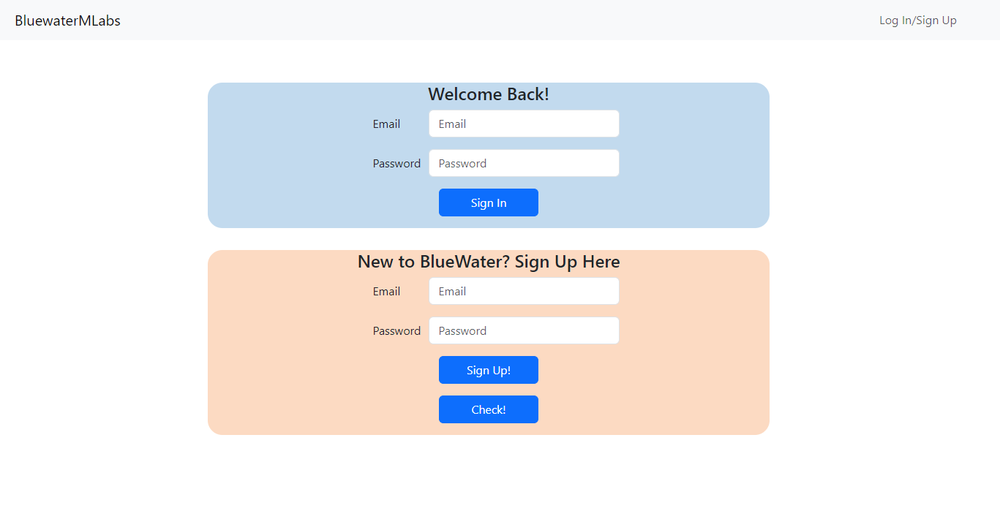
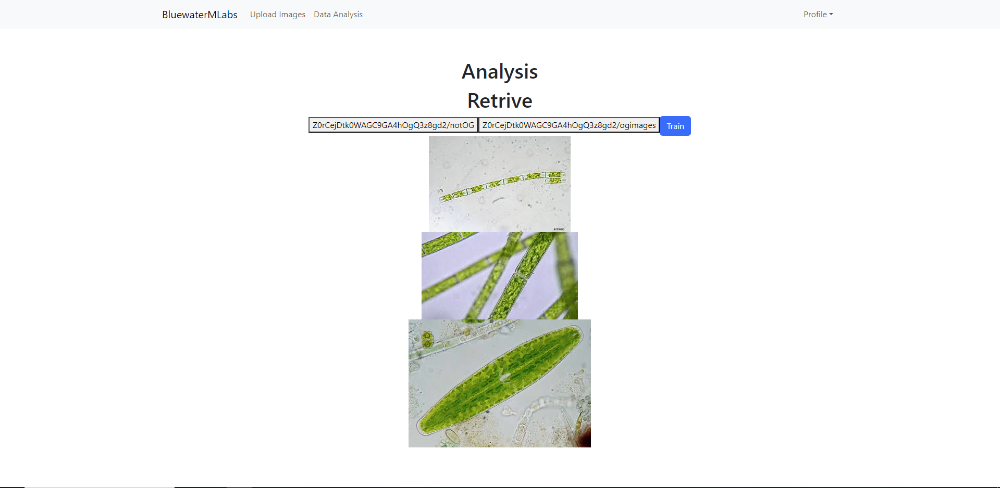
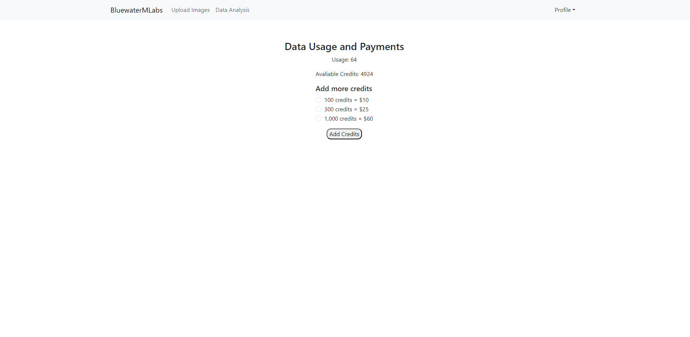

# cannon-beach
This research project is a collaboration effort w/ my academic partner to segment and identify algae samples from microscope. The goal is to build a tool that helps marine researchers indentify alage from a micro scope image. The process to indentifly algae contains two parts. One, image sementation. This is achieved via image blur and boundry seperation. Image sementation is needed due to the nature of the images from the lab. At times, multiple alage can be in one mircoscope image, additionally traning/labeled images are more "zoomed" in, just for the yhat calculation, we need to zoom in a bit on the microscope images to aid the model calculation. 

In short:__
User images -> image processing -> image classification -> result/reporting. 
User makes corrections -> add new images to traning set -> rerun image classification model. 

## Image segmentation and CV model
openCV, pytorch, matplotlib, numpy

## Front-end
React/Vite, Redux, Router, Bootstrap

## Back-end
Express, MongoDB, Firebase

## Features:
User auth, image upload, add credits and usage data.

## React App in action local

